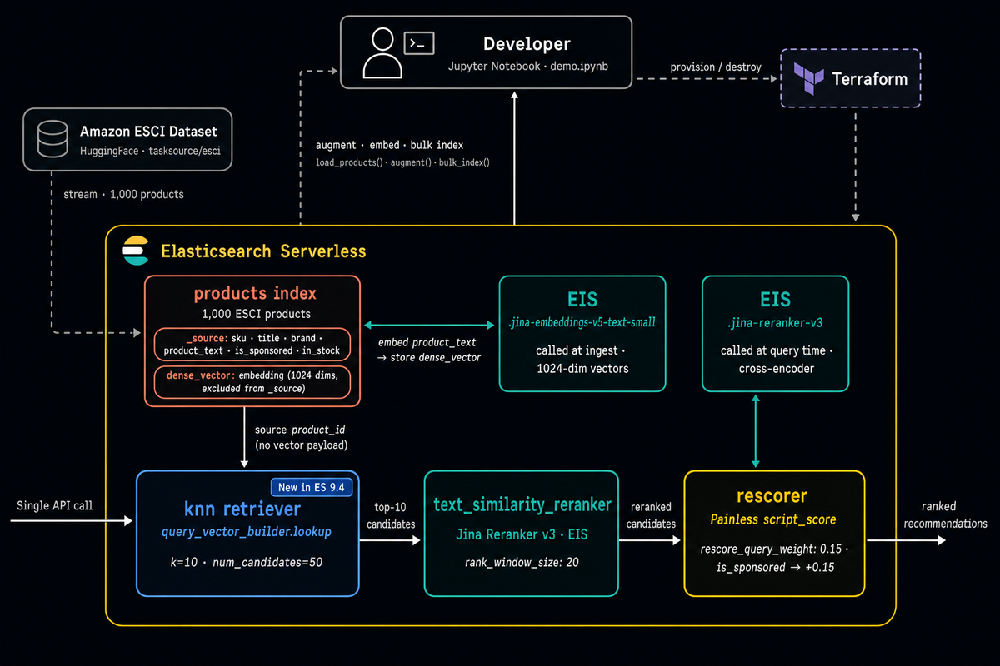

# Elastic Recommendation Engine Demo
## Contents
1.  [Summary](#summary)
2.  [Presentation](#presentation)
3.  [Architecture](#architecture)
4.  [Features](#features)
5.  [Prerequisites](#prerequisites)
6.  [Installation](#installation)
7.  [Usage](#usage)

## Summary 
This demo highlights how to create a Recommendation Engine by utilizing Elastic as a vector store.  It leverages a new feature in 9.4 that makes this approach very efficient.

## Presentation 
https://joeywhelan.github.io/rec-engine/

## Architecture 
 

## Features 
- Jupyter notebook
- Builds an Elastic Serverless project via Terraform
- Creates a dataset of products from the Amazon ESCI with synthetic co-purchase and brand sponsorship fields.
- Demonstrates the old (slower) and new (faster) methods for doing vector-based recommendations
- Deletes the entire deployment via Terraform

## Prerequisites 
- uv
- terraform
- Elastic Cloud account and API key
- Huggingface API token
- Python

## Installation 
- Edit the terraform.tfvars.sample and rename to terraform.tfvars
- Install dependencies: `uv sync`

## Usage 
- Launch the notebook: uv run jupyter notebook demo.ipynb
- Run cells top-to-bottom (linear execution required)