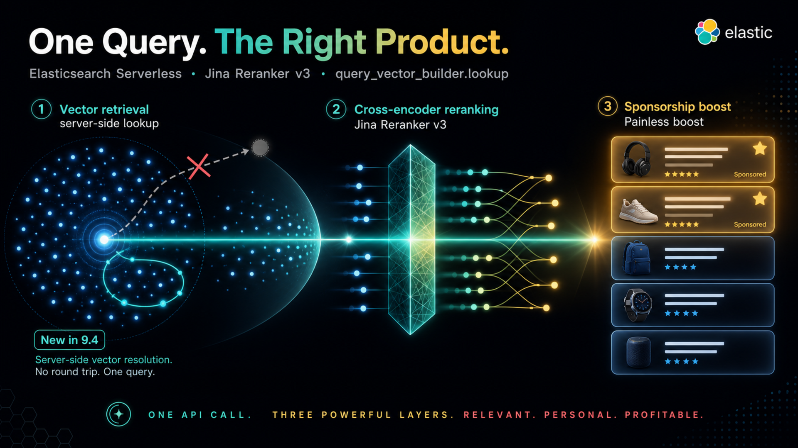
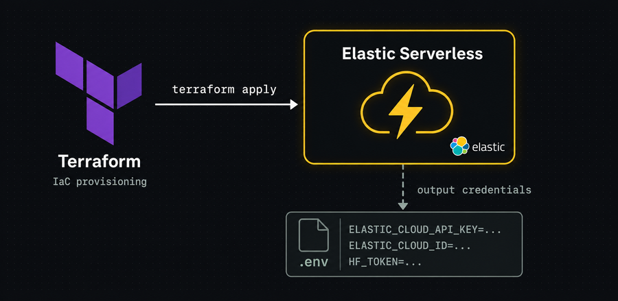
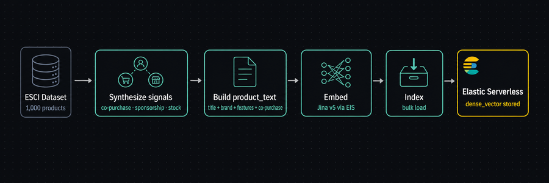
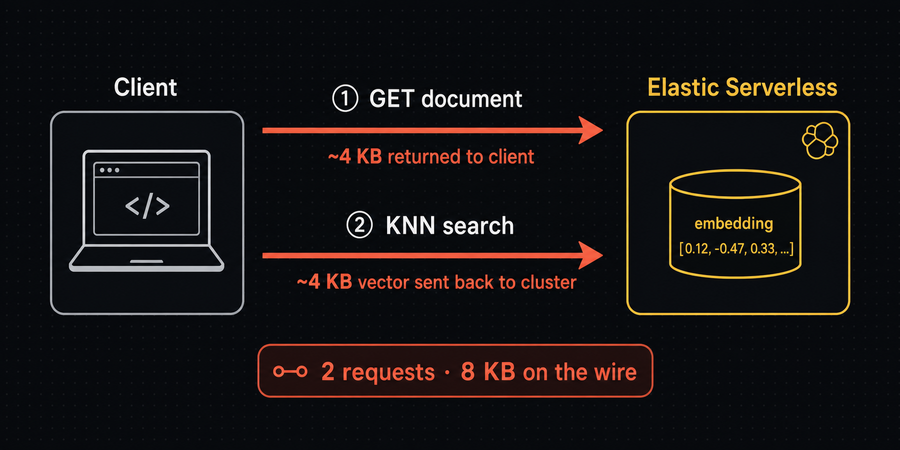
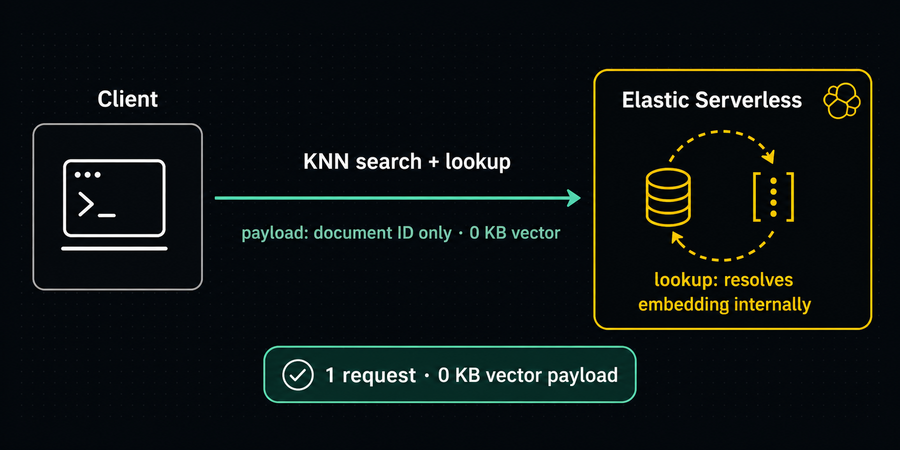
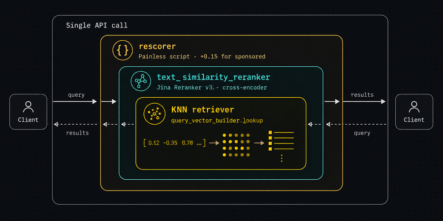
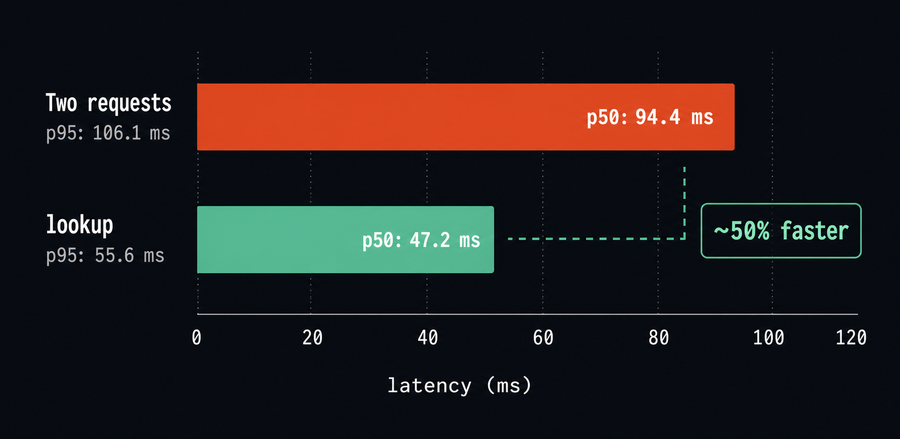
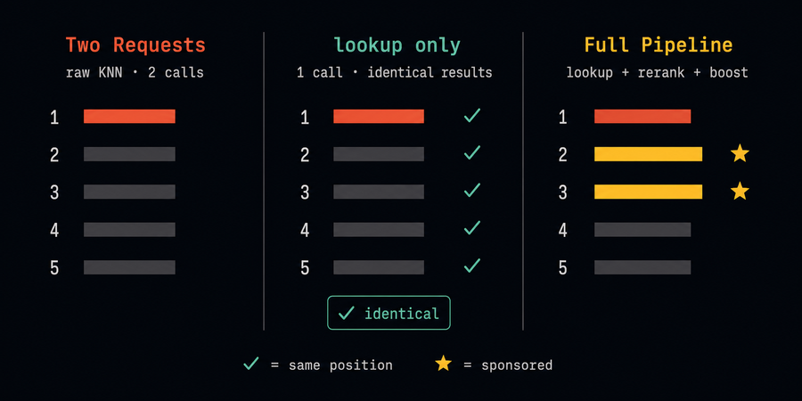

# Better Recommendations, Half the Requests: `query_vector_builder.lookup` in Action
*Elasticsearch 9.4's `query_vector_builder.lookup` collapses KNN search, reranking, and business-logic boosts into a single API call. This article shows how I built that into a recommendation engine.*

In this article, I cover the use of a new API feature that accelerates vector retrieval in Elasticsearch.  The feature, [query_vector_builder.lookup](https://www.elastic.co/docs/reference/query-languages/query-dsl/query-dsl-knn-query#knn-query-builder-lookup), provides a single API call that is suited to implementing a recommendation engine via a vector store in Elasticsearch.  This feature was released with the 9.4 GA version and was covered in this [blog](https://www.elastic.co/search-labs/blog/elasticsearch-vector-search-lookup) by its creator.

The notebook associated with this article demonstrates a product recommendation engine built on Elasticsearch Serverless. It walks through three progressively richer approaches to the same query — "find products similar to this one" — using a 1,000-product subset of the Amazon ESCI (E-commerce Shopping Queries) dataset.

The central theme is that `query_vector_builder.lookup` eliminates the traditional two-request pattern for stored-vector KNN search. On top of that, the notebook layers Jina Reranker v3 and a Painless sponsorship boost to show how all three compose into a single Elasticsearch API call.

---

## What This Article Covers

- Provision an [Elastic Serverless](https://www.elastic.co/cloud/serverless) project via Terraform
- Build a products dataset from the Amazon ESCI with synthetic co-purchase and brand sponsorship fields
- Use behavioral signals to influence relevance ranking — both inside the vector embedding and outside it
- Compare the old (slower) and new (faster) methods for doing vector-based recommendations

---

## Architecture


---

## Elastic Serverless Provisioning


I use Terraform to build an Elastic Serverless deployment. I store my API key in a Terraform variables file that I don't commit to GitHub. Those variables get written out to a `.env` file that's subsequently loaded via Python (`load_dotenv`).

```bash
echo "--- Initializing ---"
terraform -chdir=terraform init -upgrade -input=false > /dev/null && echo "Done."
echo "--- Applying Changes ---"
terraform -chdir=terraform apply -auto-approve > /dev/null && echo "Done."

echo "--- Exporting Environment Variables ---"
cat > .env << EOF
ELASTIC_CLOUD_API_KEY=$(terraform -chdir=terraform output -raw elastic_cloud_api_key)
ELASTIC_CLOUD_ID=$(terraform -chdir=terraform output -raw elastic_cloud_id)
HF_TOKEN=$(terraform -chdir=terraform output -raw hf_token)
EOF
echo "Done."
```

---

## Data Ingestion


I load 1,000 English product records from the Amazon ESCI dataset and prepare them for indexing in four steps:

1. **Synthesize signals** — co-purchase affinity (same-brand clusters as a proxy for transaction history), sponsorship (~30% of products, weighted toward high-frequency brands), and in-stock status are added as synthetic fields. In production these would come from transaction logs, contract data, and inventory systems.
2. **Build `product_text`** — concatenates title, brand, description, key features, and co-purchase titles into a single string. I include co-purchase titles in the embedded text on purpose.  Products bought together end up closer in vector space, so co-purchase affinity feeds KNN similarity directly instead of riding along as a separate re-ranking signal.
3. **Embed** — `product_text` is batch-embedded via Elastic Inference Service (EIS) using Jina v5-text-small. Vectors are stored as `dense_vector`.
4. **Index** — creates the `products` index and bulk-loads all documents.

The source product printed below is used in all the following sections.

```text
Source product
────────────────────────────────────────────────────────────
SKU:       B08PNRWW11
Title:     Catfish Hooks Big River Bait Hook Size 6/0,50PCS High Carbon Steel Fishing Hooks Saltwater Black Nicke Heavy dutyl
Brand:     KUNSILANE
Sponsored: False
In stock:  True
```

---

## The Before: Two Round Trips


The traditional pattern for "find products similar to a stored item" requires two sequential requests:

1. **GET** the source document to retrieve its embedding vector (~4 KB returned to the client)
2. **KNN search** with that vector in the request body (~4 KB sent back to the cluster)

The vector crosses the network twice (out, then back) even though the cluster already holds it. Both the latency cost and the payload overhead scale with embedding dimensionality.

### Two-request Pattern
```python
doc = es.get(index=INDEX_NAME, id=source["product_id"], _source_includes=["embedding"])
stored_vector = doc["_source"]["embedding"]

results_before = es.search(
    index=INDEX_NAME,
    body={
        "knn": {
            "field":        "embedding",
            "query_vector": stored_vector,       # vector sent back over the wire
            "k":            10,
            "num_candidates": 50,
            "filter": {"bool": {
                "must":     [{"term": {"in_stock": True}}],
                "must_not": [{"term": {"sku": source["product_id"]}}]
            }}
        },
        "_source": ["sku", "title", "brand", "is_sponsored"]
    }
)
```

### Results
```text
Request 1 — GET (vector fetch)
  Dims: 1024
  Payload: ~4.0 KB returned to client

Request 2 — KNN search
  Payload: ~4.0 KB sent to cluster
Before — two requests, raw KNN
────────────────────────────────────────────────────────────
 1. [0.9028] Dr.Fish Pack of 30 6/0 Octopus Circle Hooks Catfish Live Bait Fishing Hooks Offset Stainless Saltwater Competition Fishing Surf Fishing Hook
 2. [0.8892] Bass Fishing Worm Hooks Set, 120pcs 3X Offset Fishing Hooks Bass High Carbon Steel Worm Bait Hooks Jig Fish Hooks for Bass Trout Saltwater Freshwater Fishing Tackle Accessories
 3. [0.8772] Double Fishing Hooks Frog Hooks, 50pcs High Carbon Steel Dual Frog Hooks Classic Open Shank Double Frog Hooks Barb Fishing Bait Hooks Saltwater Freshwater Size 8#-4/0
 4. [0.8690] Beoccudo Baitholder Fishing Hooks, Saltwater Freshwater Long Shank Jig Barbed Hook for Bass Walleye Flounder
 5. [0.8690] JL Sport Classic Sharp Durable Double Hooks - 20pcs High Carbon Steel Saltwater Hook Small Fly Tying Fishing Hooks
 6. [0.8689] 60PCS/Box DERKERL Circle Fishing Hooks, Duplex Stainless Steel Forged Long Shank Hook Extra Strong Fish Hook Extra Strong Stainless Steel Fishing Hooks 6 Sizes: 4/0 5/0 6/0 7/0 8/0 9/0# ★
 7. [0.8674] THKFISH 50pcs/Box Inline Single Hook Large Eye with Barbed Replacement Fishing Hook for Spoon Lures Baits Jigs Spinner #2#1 1/0 2/0 3/0 Black ★
 8. [0.8619] Fishing Hooks Saltwater Live Bait Hooks 2X Strong Stainless Steel Fishing Hook Bait Fish Hooks Set
 9. [0.8503] Small Fishing Hooks 500pcs Black High Carbon Fishing Hooks Set 10 Sizes with a Plastic Box (500pcs)
10. [0.8440] Baitholder Beak Hook Wire Leader Rig - 24pcs Bottom Fishing Rig Nylon Coated Wire Leaders Rig with Baitholder Barb Hooks Rolling Swivel Fishing Lure Bait Rig Saltwater Freshwater Fishing

★ = sponsored
```

---

## The After: `query_vector_builder.lookup`


`query_vector_builder.lookup` (ES 9.4) resolves the vector server-side. The client sends only the document ID; the cluster fetches the embedding internally and executes the KNN search in a single request with zero vector payload.

### One-request Pattern
```python
results_after = es.search(
    index=INDEX_NAME,
    body={
        "knn": {
            "field": "embedding",
            "query_vector_builder": {
                "lookup": {
                    "index": INDEX_NAME,
                    "id":    source["product_id"],
                    "path":  "embedding"
                }
            },
            "k":              10,
            "num_candidates": 50,
            "filter": {"bool": {
                "must":     [{"term": {"in_stock": True}}],
                "must_not": [{"term": {"sku": source["product_id"]}}]
            }}
        },
        "_source": ["sku", "title", "brand", "is_sponsored"]
    }
)
```

### Results
The results are identical.
```text
Request count: 1
Client payload: 0 KB (no vector sent)
After — single request, lookup
────────────────────────────────────────────────────────────
 1. [0.9028] Dr.Fish Pack of 30 6/0 Octopus Circle Hooks Catfish Live Bait Fishing Hooks Offset Stainless Saltwater Competition Fishing Surf Fishing Hook
 2. [0.8892] Bass Fishing Worm Hooks Set, 120pcs 3X Offset Fishing Hooks Bass High Carbon Steel Worm Bait Hooks Jig Fish Hooks for Bass Trout Saltwater Freshwater Fishing Tackle Accessories
 3. [0.8772] Double Fishing Hooks Frog Hooks, 50pcs High Carbon Steel Dual Frog Hooks Classic Open Shank Double Frog Hooks Barb Fishing Bait Hooks Saltwater Freshwater Size 8#-4/0
 4. [0.8690] Beoccudo Baitholder Fishing Hooks, Saltwater Freshwater Long Shank Jig Barbed Hook for Bass Walleye Flounder
 5. [0.8690] JL Sport Classic Sharp Durable Double Hooks - 20pcs High Carbon Steel Saltwater Hook Small Fly Tying Fishing Hooks
 6. [0.8689] 60PCS/Box DERKERL Circle Fishing Hooks, Duplex Stainless Steel Forged Long Shank Hook Extra Strong Fish Hook Extra Strong Stainless Steel Fishing Hooks 6 Sizes: 4/0 5/0 6/0 7/0 8/0 9/0# ★
 7. [0.8674] THKFISH 50pcs/Box Inline Single Hook Large Eye with Barbed Replacement Fishing Hook for Spoon Lures Baits Jigs Spinner #2#1 1/0 2/0 3/0 Black ★
 8. [0.8619] Fishing Hooks Saltwater Live Bait Hooks 2X Strong Stainless Steel Fishing Hook Bait Fish Hooks Set
 9. [0.8503] Small Fishing Hooks 500pcs Black High Carbon Fishing Hooks Set 10 Sizes with a Plastic Box (500pcs)
10. [0.8440] Baitholder Beak Hook Wire Leader Rig - 24pcs Bottom Fishing Rig Nylon Coated Wire Leaders Rig with Baitholder Barb Hooks Rolling Swivel Fishing Lure Bait Rig Saltwater Freshwater Fishing

★ = sponsored
```

## Full Pipeline: lookup + Rerank + Sponsorship Boost


This section adds two layers on top of the previous section's lookup, all composed into a single API call:

**Step 1: Rerank.** The `text_similarity_reranker` wraps the KNN retriever. Jina Reranker v3 re-scores all KNN candidates by full text similarity against `product_text`, surfacing items that are semantically closest, which is not always the same as nearest in raw vector space.

**Step 2: Sponsorship boost.** A `rescorer` wraps the reranker. A Painless script adds a fixed delta of 0.15 to any sponsored item, leaving all other scores untouched.

```
Single API call
│
└── rescorer retriever
    │   Painless script_score: +0.15 for sponsored items
    │
    └── text_similarity_reranker retriever
        │   Jina Reranker v3 (cross-encoder, via EIS)
        │   rank_window_size: 10
        │   Cross-attention sees source + candidate together
        │
        └── knn retriever
                query_vector_builder.lookup → embedding field
                k=10, num_candidates=50
                filter: in_stock=true, exclude source SKU
```

| Layer | Tool | Signal |
|---|---|---|
| Retrieval | KNN + `lookup` | Semantic similarity |
| Reranking | Jina Reranker v3 (EIS) | Cross-attention quality |
| Boost | Painless `script_score` | Sponsorship |

### Composed Retriever
```python
results_full = es.search(
    index=INDEX_NAME,
    body={
        "retriever": {
            "rescorer": {
                "retriever": {
                    "text_similarity_reranker": {
                        "retriever": {
                            "knn": {
                                "field": "embedding",
                                "query_vector_builder": {
                                    "lookup": {
                                        "index": INDEX_NAME,
                                        "id":    source["product_id"],
                                        "path":  "embedding"
                                    }
                                },
                                "k":              10,
                                "num_candidates": 50,
                                "filter": {"bool": {
                                    "must":     [{"term": {"in_stock": True}}],
                                    "must_not": [{"term": {"sku": source["product_id"]}}]
                                }}
                            }
                        },
                        "field":            "product_text",
                        "inference_id":     RERANKER_INFERENCE_ID,
                        "inference_text":   source["product_text"],
                        "rank_window_size": 10
                    }
                },
                "rescore": {
                    "window_size": 10,
                    "query": {
                        "rescore_query": {
                            "script_score": {
                                "query": {"match_all": {}},
                                "script": {
                                    "source": "return doc['is_sponsored'].value ? 1.0 : 0.0;",
                                }
                            }
                        },
                        "rescore_query_weight": 0.15
                    }
                }
            }
        },
        "_source": ["sku", "title", "brand", "is_sponsored"]
    }
)
```

### Results
Note the two sponsored products (THKFISH and DERKERL) were promoted to the #2 and #3 positions.  Without the sponsorship boost, they were at #6 and #8.
```text
Full pipeline — lookup + rerank + boost
────────────────────────────────────────────────────────────
 1. [1.3078] Dr.Fish Pack of 30 6/0 Octopus Circle Hooks Catfish Live Bait Fishing Hooks Offset Stainless Saltwater Competition Fishing Surf Fishing Hook
 2. [1.1548] THKFISH 50pcs/Box Inline Single Hook Large Eye with Barbed Replacement Fishing Hook for Spoon Lures Baits Jigs Spinner #2#1 1/0 2/0 3/0 Black ★
 3. [1.1074] 60PCS/Box DERKERL Circle Fishing Hooks, Duplex Stainless Steel Forged Long Shank Hook Extra Strong Fish Hook Extra Strong Stainless Steel Fishing Hooks 6 Sizes: 4/0 5/0 6/0 7/0 8/0 9/0# ★
 4. [1.0816] Beoccudo Baitholder Fishing Hooks, Saltwater Freshwater Long Shank Jig Barbed Hook for Bass Walleye Flounder
 5. [1.0549] Fishing Hooks Saltwater Live Bait Hooks 2X Strong Stainless Steel Fishing Hook Bait Fish Hooks Set
 6. [1.0159] Double Fishing Hooks Frog Hooks, 50pcs High Carbon Steel Dual Frog Hooks Classic Open Shank Double Frog Hooks Barb Fishing Bait Hooks Saltwater Freshwater Size 8#-4/0
 7. [1.0054] JL Sport Classic Sharp Durable Double Hooks - 20pcs High Carbon Steel Saltwater Hook Small Fly Tying Fishing Hooks
 8. [0.9638] Bass Fishing Worm Hooks Set, 120pcs 3X Offset Fishing Hooks Bass High Carbon Steel Worm Bait Hooks Jig Fish Hooks for Bass Trout Saltwater Freshwater Fishing Tackle Accessories
 9. [0.9556] Small Fishing Hooks 500pcs Black High Carbon Fishing Hooks Set 10 Sizes with a Plastic Box (500pcs)
10. [0.8913] Baitholder Beak Hook Wire Leader Rig - 24pcs Bottom Fishing Rig Nylon Coated Wire Leaders Rig with Baitholder Barb Hooks Rolling Swivel Fishing Lure Bait Rig Saltwater Freshwater Fishing

★ = sponsored
```

## Latency Comparison


Below are latency comparisons of the two vector lookup patterns discussed in the previous sections.  One thing to note: Elastic Serverless does not support clearing the cache, so all measurements are steady-state (cache-warm).  As expected, the new 9.4 feature yielded a considerable latency reduction — ~50%.

```text
Pattern                     p50 (ms)    p95 (ms)    min (ms)
────────────────────────────────────────────────────────────
Two requests (before)           94.4       106.1        78.4
lookup (after)                  47.2        55.6        36.1
```

---

## Summary


Below all three approaches are set side by side for the same source product:

| Column | Approach |
|---|---|
| **Two Requests** | Raw KNN with client-side vector payload |
| **lookup only** | Server-side vector resolution, identical results |
| **Full Pipeline** | lookup + Jina rerank + sponsorship boost |

**✓** marks positions where the lookup result matches the two-request result exactly — confirming drop-in equivalence. **★** marks sponsored products elevated by the boost.

```text
Source: Catfish Hooks Big River Bait Hook Size 6/0,50PCS High Carbon Steel Fishing Hooks Saltwater Black Nicke Heavy dutyl

Rank  Two Requests (before)            lookup only (after)              Full Pipeline
────  ──────────────────────────────── ──────────────────────────────── ────────────────────────────────
  1.  Dr.Fish Pack of 30 6 [0.9028]  Dr.Fish Pack of 30 6 [0.9028]✓ Dr.Fish Pack of 30 6 [1.3078]  
  2.  Bass Fishing Worm Ho [0.8892]  Bass Fishing Worm Ho [0.8892]✓ THKFISH 50pcs/Box In [1.1548]★ 
  3.  Double Fishing Hooks [0.8772]  Double Fishing Hooks [0.8772]✓ 60PCS/Box DERKERL Ci [1.1074]★ 
  4.  Beoccudo Baitholder  [0.8690]  Beoccudo Baitholder  [0.8690]✓ Beoccudo Baitholder  [1.0816]  
  5.  JL Sport Classic Sha [0.8690]  JL Sport Classic Sha [0.8690]✓ Fishing Hooks Saltwa [1.0549]  
  6.  60PCS/Box DERKERL Ci [0.8689]  60PCS/Box DERKERL Ci [0.8689]✓ Double Fishing Hooks [1.0159]  
  7.  THKFISH 50pcs/Box In [0.8674]  THKFISH 50pcs/Box In [0.8674]✓ JL Sport Classic Sha [1.0054]  
  8.  Fishing Hooks Saltwa [0.8619]  Fishing Hooks Saltwa [0.8619]✓ Bass Fishing Worm Ho [0.9638]  
  9.  Small Fishing Hooks  [0.8503]  Small Fishing Hooks  [0.8503]✓ Small Fishing Hooks  [0.9556]  
 10.  Baitholder Beak Hook [0.8440]  Baitholder Beak Hook [0.8440]✓ Baitholder Beak Hook [0.8913]  

✓ = same position as before   ★ = sponsored product
```

---

## Source

Full source code on [GitHub](https://github.com/joeywhelan/rec-engine).

---